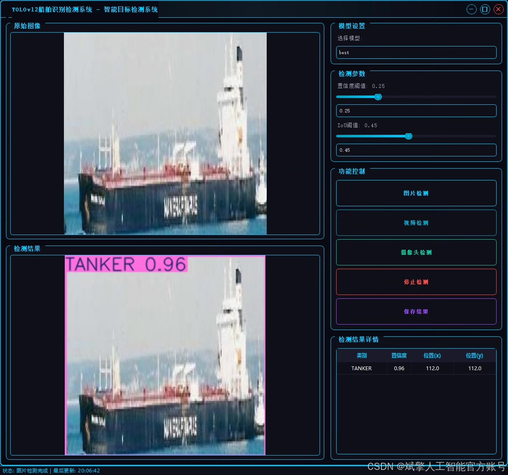
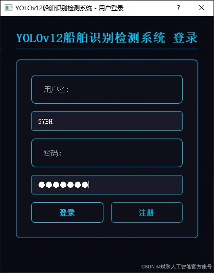
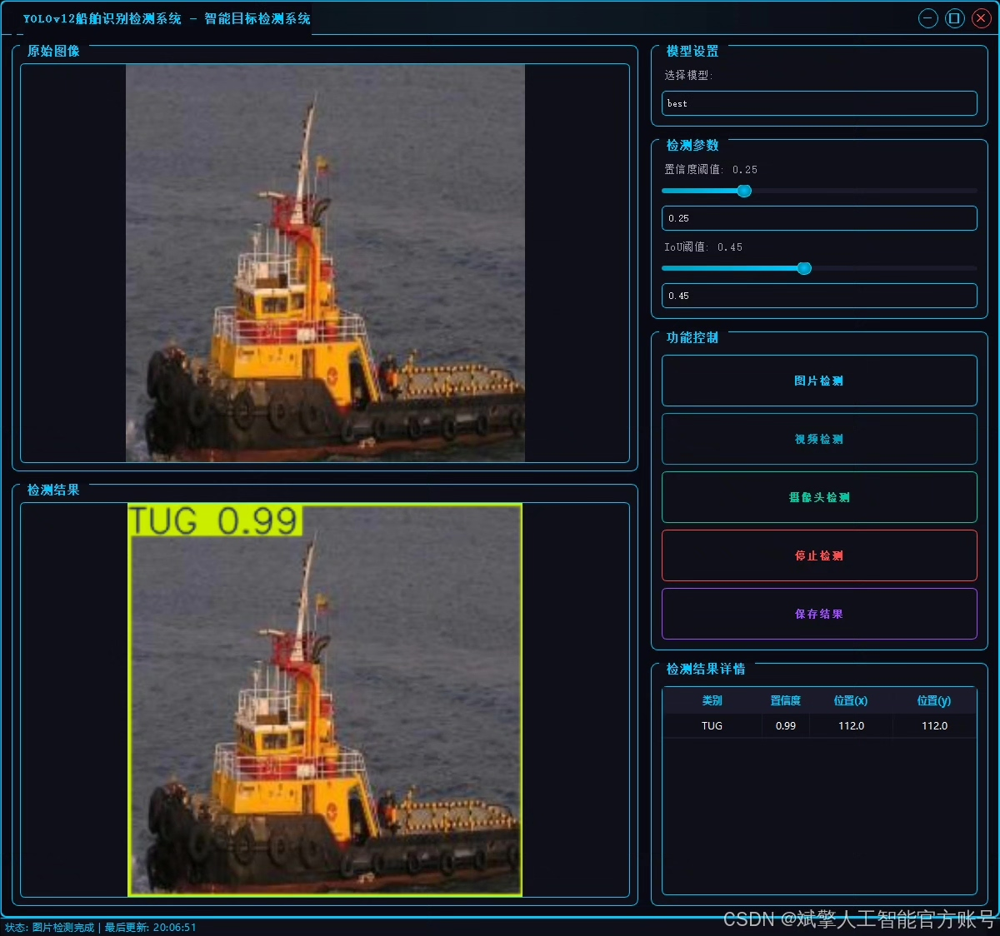
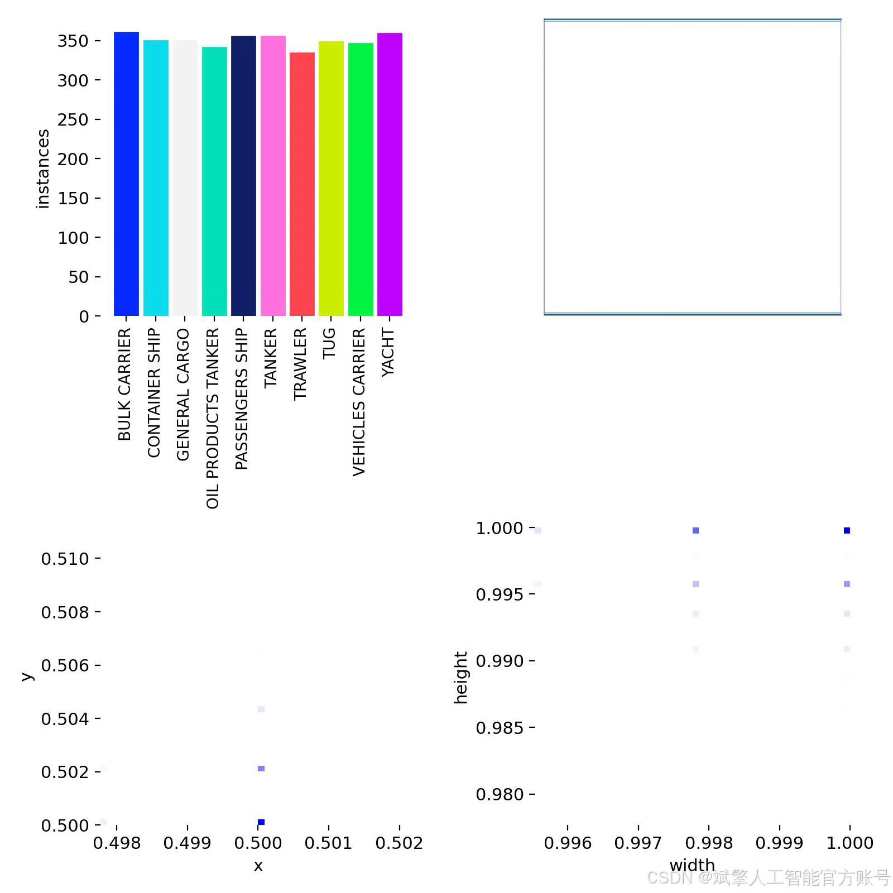
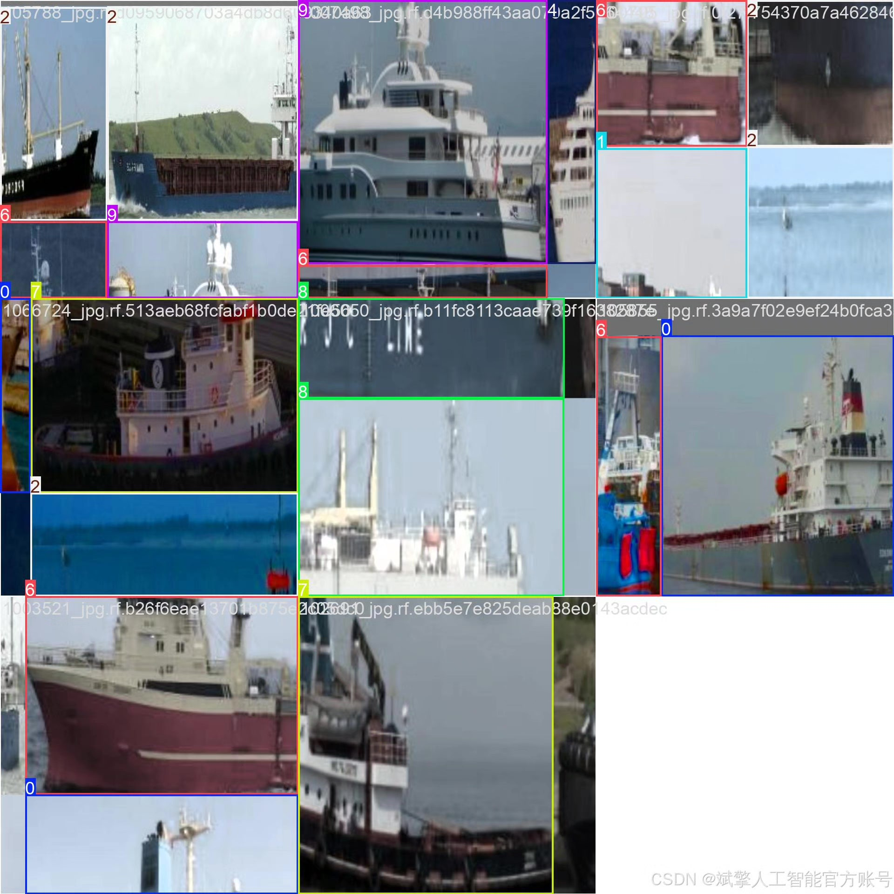
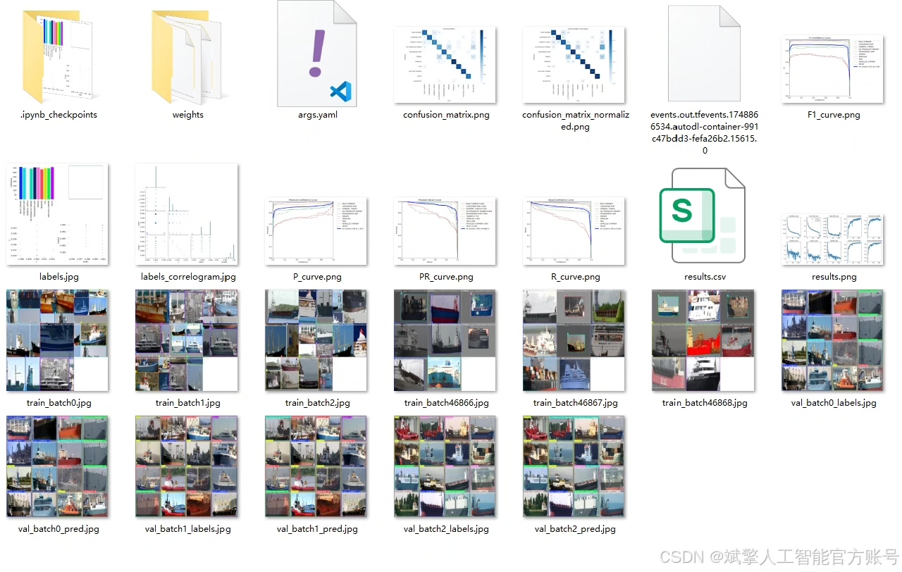
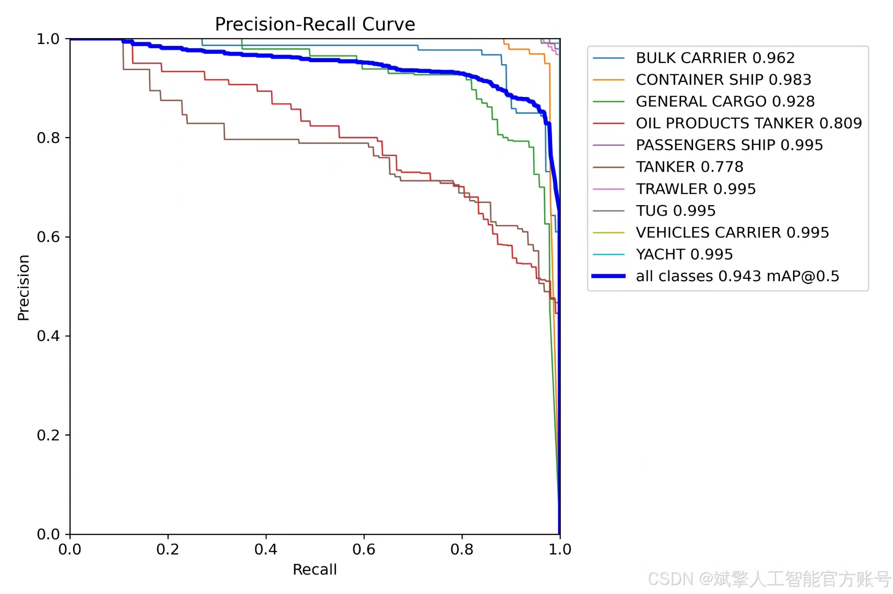
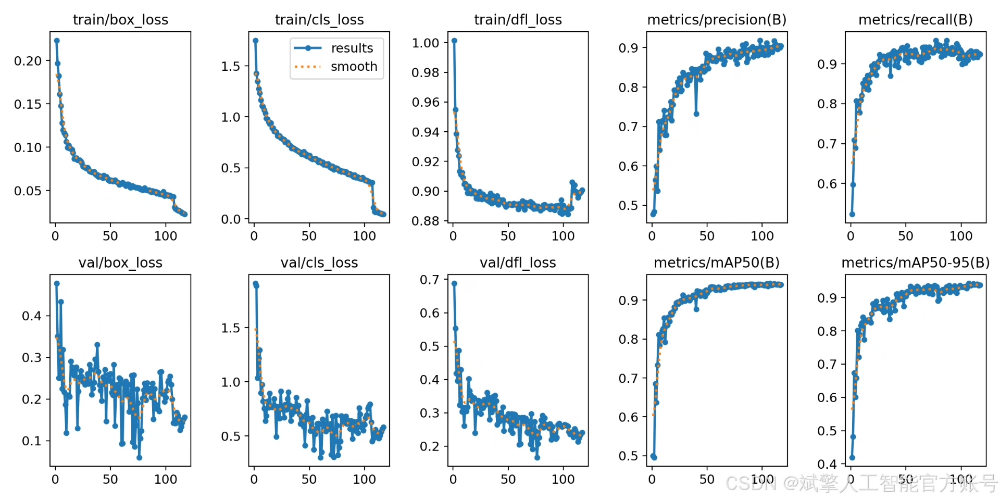
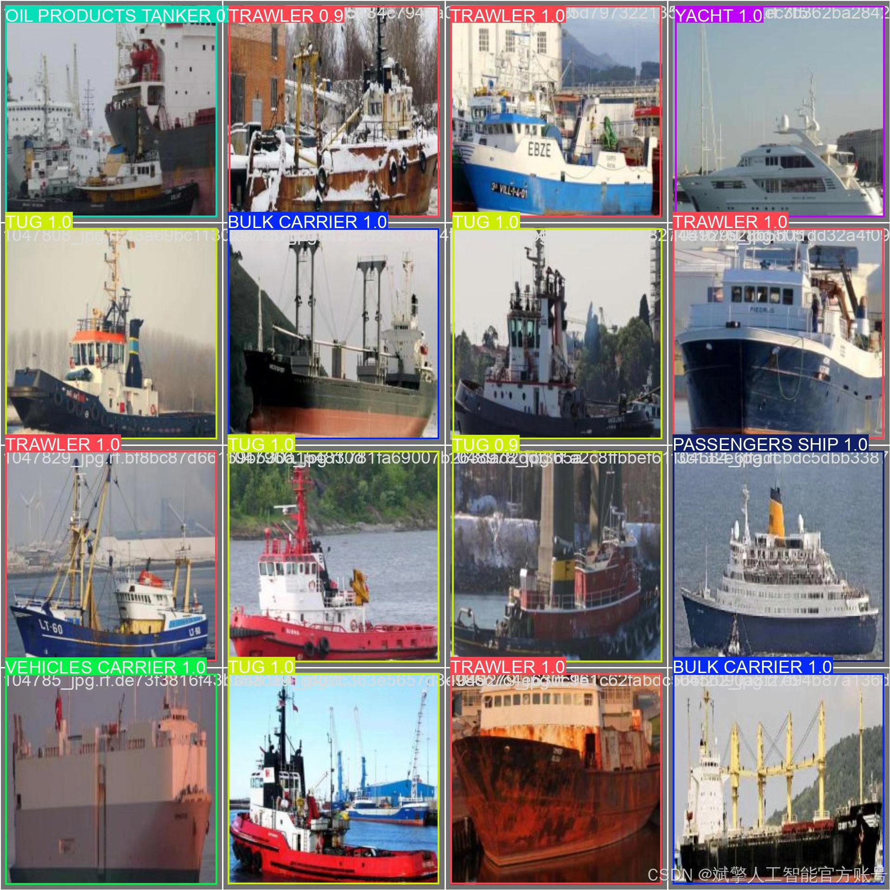

# YOLOv12 Ship Type Recognition System

## Body

YOLOv12 Ship Type Recognition System, based on the deep learning framework YOLOv12, has developed an efficient and precise ship type recognition detection system that supports real-time detection and classification of 10 types of ship targets. The system integrates the high-performance advantages of the YOLOv12 algorithm and incorporates a user-friendly UI interface, login registration functions, providing a full process solution from data labeling to model training and inference deployment. Through a diverse dataset constructed with 3,498 training images, 1,000 validation images, and 500 test images, the model demonstrates strong robustness in complex scenarios and can be widely applied in maritime regulation, port dispatching, fishery management, and other scenarios.
✅ User Login and Registration: Supports password verification and security validation.
✅ Three Detection Modes: Based on the YOLOv12 model, supports image, video, and real-time camera detection, accurately recognizing targets.
✅ Dual Screen Comparison: Displays the original image and detection results on the same screen.
✅ Data Visualization: Real-time table displays the category, confidence, and coordinates of detected targets.
✅ Intelligent Parameter Tuning: Offers a confidence slide bar for dynamic optimization of detection accuracy to meet different scene needs.
✅ Sci-Fi Interactive Interface: Dark theme combined with dynamic light effects reduces visual fatigue and enhances operational experience.

## Images

## Payment

Here is a pay link on Stripe ( https://buy.stripe.com/3cs8yP7sY87d0vu9AB ). Please contact me lonlonago@foxmail.com after funding $89, and I will send you a complete data files , thank you!

